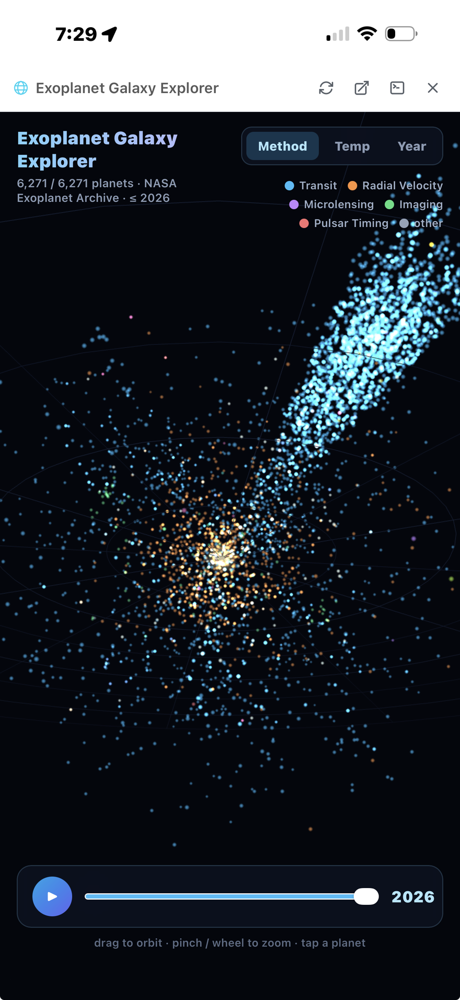

# Xylocopa

[](LICENSE) [](https://www.python.org/downloads/) [](https://react.dev) [](https://fastapi.tiangolo.com)

> [**The Loop**](#the-loop) · [**Features**](#features) · [**Getting Started**](#getting-started) · [**What's New**](CHANGELOG.md) · [**新手入门（中文）**](docs/getting-started-zh.md)

<p align="center"></p>

**Xylocopa is a visual orchestrator for your [Claude Code](https://docs.anthropic.com/en/docs/claude-code) agents — it keeps you focused while they do the work. Deploy it on your computer and manage your work from anywhere.**

*Named after [Xylocopa caerulea](https://en.wikipedia.org/wiki/Xylocopa_caerulea), the blue carpenter bee — xylocopa (zy-LOCK-uh-puh) is Greek for "wood-cutter". If you find it useful, a star helps others find it.*

|  |  |  |
|:---:|:---:|:---:|
| Inbox | Projects | Agents |
|  |  |  |
| Chat | Interactive artifact | Monitor |

## The Loop

The workflow follows [GTD](https://gettingthingsdone.com/what-is-gtd/), with agents as the executor:

1. **Capture** — dump tasks into the inbox from anywhere: type, speak, or quick entry.
2. **Dispatch** — one click turns a task into an agent; agents run in parallel, each in its own git worktree, seeded with lessons from past sessions.
3. **Monitor** — the attention button always takes you to the agent that needs you; approve plans and tool calls in chat; notifications fire only when you're away.
4. **Review** — approve and close, or retry: a stopped attempt is auto-summarized, so the next agent starts from that summary instead of from zero.
5. **Remember** — lessons land in each project's `PROGRESS.md` and are retrieved for future agents; every conversation stays searchable and resumable.

Every agent runs in a tmux session you can attach to from a terminal, and CLI sessions show up in the web app — sync is two-way:


## Features

| Category | What you get |
|---|---|
| **Tasks & history** | Inbox with voice input, quick capture, drag-to-reorder, draft persistence; retry with auto-summarization; every conversation persisted, full-text searchable, resumable; star sessions, bookmark messages. |
| **Agent control** | Start/stop/resume; per-agent model, timeout, and permission mode; batch dispatch; lesson retrieval at dispatch; agents read each other's sessions over MCP at ~54× fewer tokens than raw JSONL. |
| **Chat** | Markdown, inline media, LaTeX; plan-review and tool-approval cards; context-usage and lifetime-cost breakdowns; double-tap a bubble to bookmark, modify, or fork ([gestures](docs/gestures.md)). |
| **Interactive artifacts** | Agents present runnable deliverables as cards: web apps served sandboxed, localhost services reverse-proxied (HTTP + WebSocket), console drawer for debugging — the screenshot above is an agent-built 3D explorer of 6,271 NASA exoplanets, in chat on an iPhone. |
| **Monitoring & notifications** | Split screen (up to 4 panes), real-time WebSocket updates, system monitor (disk, memory, GPU, tokens), weekly stats; hook-based Web Push that fires when you're away and stays quiet while you watch. |
| **Attention jobs** | Reminders, schedules, and state watchers compiled from natural language ("wake me when the GPU frees up"): time, interval, app-state, and webhook triggers × push-notify, message-agent, and dispatch-task actions. An experimental orb assistant manages them from a chat bubble (off by default). |
| **Web terminal & CLI sync** | An in-chat terminal attaches to the agent's live tmux session from any browser, phone included; CLI sessions appear in the web app and web sessions resume from a terminal (`tmux attach -t xy-<id>`) — sync is two-way. |
| **Mobile PWA & themes** | Home Screen install on iOS/Android with push and voice; five preset palettes (Nord, Solarized, Everforest, …) plus a custom theme editor; e-ink display mode for e-paper readers. |
| **Git** | Per-project diffs, commit history, branch status; agents work in isolated worktrees; one-click cleanup and push. |
| <a id="safety-guardrails"></a>**Security & safety** | Password auth with rate limiting, inactivity lock, HTTPS; a deterministic `PreToolUse` hook hard-blocks destructive operations (`rm -rf`, force-pushes, `git reset --hard`, `DROP TABLE`, writes outside the project) even under `--dangerously-skip-permissions`. |
| **Reliability** | Survives restarts and kills: incremental [session cache](orchestrator/session_cache.py), tmux-anchored agent recovery, scheduled [backups](orchestrator/backup.py), [orphan cleanup](orchestrator/orphan_cleanup.py), unlimited session retention. |

## Getting Started

Prereqs: Linux or macOS, Node.js 18+, Python 3.11+, tmux, and the Claude Code CLI (`npm install -g @anthropic-ai/claude-code`, then run `claude` once to log in — a Claude Pro/Max subscription is enough; Bedrock/Vertex/LiteLLM support carries over via the usual env vars). Optional OpenAI key for voice input.

```bash
curl -fsSL https://raw.githubusercontent.com/jyao97/xylocopa/master/setup.sh | bash
```

The installer clones into `~/xylocopa-main`, prompts for projects directory / model / ports, writes `.env` ([`.env.example`](.env.example) is the annotated reference), generates SSL certs, and starts the services (manual path: `git clone` → `./setup.sh` → `./run.sh start`). Open `https://<machine-ip>:3000` and set a password on first visit. Then:

- **Add projects** — long-press **+** → **New Project**: paste a GitHub URL or point at a folder; folders in `~/xylocopa-projects/` are picked up automatically.
- **Auto-start on reboot** — `./run.sh startup` (pm2 save + startup; also detaches pm2 from your terminal's cgroup so closing it doesn't kill the services).
- <a id="remote-access"></a>**Remote access** — any VPN or tunnel works. With Tailscale: `tailscale up` on server and phone, then open `https://<tailscale-ip>:3000`; no ports exposed to the internet.
- **Phone install** — open the URL in Safari/Chrome and follow the on-screen guide to trust the self-signed certificate and add the app to your Home Screen ([per-platform cert steps](docs/install-cert.md)).
- **Your data** — SQLite DB in the install directory; sessions are Claude Code's native JSONL under `~/.claude/projects/`, not duplicated; lessons in each repo's `PROGRESS.md`. Uninstalling is one `pm2 delete` plus a few `rm -rf`s ([details](docs/uninstall.md)).

A tip: symlink the Xylocopa repo itself into `~/xylocopa-projects/` and agents can improve the tool while you use it.

## Agent control plane

Agents call back into the orchestrator through a built-in MCP server — list and create tasks, dispatch work, read other agents' sessions, scaffold projects, present web apps — restricted to non-destructive verbs. Probes are the event-driven part: an agent registers a one-shot webhook ("wake me when CI on PR #42 goes green") and hands the URL to whatever monitors the condition; POSTing it injects a message into the chat. Full tool list and safety model: [docs/agent-mcp-tools.md](docs/agent-mcp-tools.md).

## Telemetry

One anonymous event per day: random install id, version, platform, timestamp — nothing user-generated, no IPs, no prompts, no paths. Sent by [`telemetry.py`](orchestrator/telemetry.py) to a [Cloudflare Worker](https://github.com/jyao97/xylocopa-telemetry) owned by the author; no third-party analytics. Disable with the toggle in **Monitor → Help improve Xylocopa** or `XYLOCOPA_TELEMETRY=0`.

## More

[Getting started guide](docs/getting-started.md) · [Gestures](docs/gestures.md) · [Troubleshooting](docs/troubleshooting.md) · [Architecture](docs/ARCHITECTURE.md) · [Agent MCP tools](docs/agent-mcp-tools.md) · [Data & uninstall](docs/uninstall.md) · [Migrating from AgentHive](docs/migrating-from-agenthive.md)

Apache 2.0 — see [LICENSE](LICENSE). Contributions welcome: [CONTRIBUTING.md](CONTRIBUTING.md).
