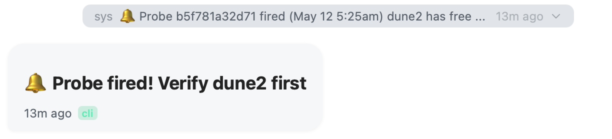

# Xylocopa

[](LICENSE)
[](https://www.python.org/downloads/)
[](https://react.dev)
[](https://fastapi.tiangolo.com)

> [**The Loop**](#the-loop) · [**Getting Started**](#getting-started) · [**Features**](#features) · [**What's New**](CHANGELOG.md) · [**Architecture**](docs/ARCHITECTURE.md) · [**Contributing**](CONTRIBUTING.md) · [**新手入门（中文）**](docs/getting-started-zh.md)

<p align="center"></p>

Xylocopa is a to-do list that runs your [Claude Code](https://docs.anthropic.com/en/docs/claude-code) agents. You capture tasks and make decisions — from your phone if you like — agents do the work in parallel across your projects, and the system keeps the history and the lessons. The workflow follows [GTD](https://gettingthingsdone.com/what-is-gtd/), with agents as the executor.

Named after [Xylocopa caerulea](https://en.wikipedia.org/wiki/Xylocopa_caerulea), the blue carpenter bee — *xylocopa* (zy-LOCK-uh-puh) is Greek for "wood-cutter". If you find it useful, a star helps others find it.

|  |  |  |
|:---:|:---:|:---:|
| Inbox | Projects | Agents |
|  |  |  |
| Chat | Interactive artifact | Monitor |

## The Loop

### 1. Capture

An inbox that works from anywhere: type a title, speak it (Whisper voice input), or use the quick-entry form. Every keystroke is cached locally, so drafts survive closing the app.

### 2. Dispatch

One click turns a task into an agent: pick a model (Opus/Sonnet/Haiku), optionally enable Auto mode (`--dangerously-skip-permissions`; destructive commands are still blocked by the [safety hook](#safety-guardrails)). Agents run in parallel, each in its own git worktree, and are seeded at dispatch time with relevant lessons retrieved from past sessions in the same project. Batch dispatch triages a pile of inbox tasks in one step.

### 3. Monitor

A mobile-first PWA with split screen (up to 4 panes) and an attention button that always takes you to the oldest unread agent. The chat renders markdown, inline media, LaTeX, and interactive cards for tool approvals and plan review.

An agent's deliverable doesn't have to be a diff. Think artifacts, but self-hosted: the `webapp_present` MCP tool posts a card that opens the agent's work fullscreen in a sandboxed iframe — a static web app it built, or a proxied localhost service (TensorBoard, dev servers) — with a console drawer for debugging. Panels minimize to a dock and keep running while you browse — restore is instant — and are torn down when their agent stops. Touch interaction works on mobile: the interactive-artifact screenshot up top is an agent-built 3D explorer of 6,271 planets from the NASA Exoplanet Archive, running sandboxed in chat on an iPhone.

Every agent runs in a tmux session you can attach to from a terminal, and CLI sessions show up in the web app — sync is two-way.


Push notifications fire when you're away and stay quiet while you're watching. For external conditions, an agent can register a one-shot webhook ([probe](#agent-control-plane)) and be woken when CI finishes, a GPU frees up, or a build completes.



### 4. Review

Approve and close, or retry: stopping a missed attempt auto-summarizes what was tried, and the next agent starts from that summary instead of from zero. Diffs, commit history, and branch status are available per project, with one-click cleanup and push.

### 5. Remember

Lessons accumulate in a per-project `PROGRESS.md` that you can edit in the UI; relevant entries are retrieved for future agents. Every conversation is persisted, searchable, and resumable. Double-tap any chat bubble to bookmark it. Weekly stats show the trend, and backups run on a schedule.

## Why Xylocopa?

Plain `claude` works for one-off sessions. It frays once several run in parallel, across projects, over days: you lose track of which agent needs input, old sessions are hard to find, and every retry starts from scratch.

Xylocopa is the task, attention, and memory layer around the same CLI. It launches the `claude` you already use inside tmux on your machine, so your CLAUDE.md files, project setup, and credentials carry over. The only new dependencies are tmux and, for remote access, a VPN such as Tailscale. And it's a server plus PWA rather than a desktop app: install it once on the machine where your code lives, then drive it from any browser — including the one in your pocket.

The design assumes agents miss. Stopping a bad attempt produces a summary; the next attempt picks it up; durable lessons land in per-project memory rather than dying with the session.

## Features

| Category | What you get |
|---|---|
| **Notifications** | Hook-based Web Push (VAPID): notifies when you're away, quiet when you're viewing the agent. Permission requests always cut through. Per-agent mute, global toggles. |
| **Task management** | Inbox with drag-to-reorder, voice input, quick capture, draft persistence, per-project organization, retry with auto-summarization. |
| **Agent control** | Start/stop/resume (re-sync to existing tmux, or relaunch via `claude --resume`). Per-agent model selection, timeouts, permission modes. Batch dispatch. Context retrieval from past sessions at dispatch. Cross-session reference over MCP: agents read each other's curated display files at ~54× fewer tokens than raw JSONL. Subagent sessions surfaced in a Task → Xylo → CC → Sub-session hierarchy. |
| **Chat** | Markdown, code blocks, tables, inline media, LaTeX. Plan approve/reject and tool-confirmation cards. Context-usage pill with a per-category breakdown read from the session JSONL. Per-agent lifetime cost (per-model pricing, cache-tier split). |
| **Interactive artifacts** | Agents present runnable deliverables as tappable cards (`webapp_present`): static apps served sandboxed, localhost services reverse-proxied (HTTP + WebSocket), external dashboards linked. Credential-less iframe sandbox; injected console capture feeds a debug drawer. |
| **Monitoring** | Split screen, real-time WebSocket updates, system monitor (disk, memory, GPU, tokens), weekly progress stats. |
| **Mobile PWA** | Home Screen install on iOS/Android with push and voice. E-ink display mode (high-contrast rendering, two-finger swipe to page-scroll) for e-paper readers. |
| **CLI sync** | Two-way: CLI sessions appear in the web app; web sessions resume from the CLI via `tmux attach -t xy-<id>`. |
| **Git** | Per-project commit history, diffs, branch status. Agents work in isolated worktrees. One-click cleanup and push. |
| **History** | Every conversation persisted and full-text searchable. Star sessions, bookmark messages (with generated summaries), resume any agent. |
| **Security** | Password auth with rate limiting, inactivity lock, HTTPS. |
| <a id="safety-guardrails"></a>**Safety guardrails** | A deterministic `PreToolUse` hook hard-blocks destructive operations — `rm -rf`, force-pushes, `git reset --hard` outside worktrees, `git clean -f`, `DROP TABLE`/`TRUNCATE`, writes outside the project directory — even under `--dangerously-skip-permissions`. |
| **Reliability** | See [Durable by default](#durable-by-default). |

## Durable by default

Every layer is built to survive restarts, crashes, and process kills. Each bullet links to its implementation:

- [`session_cache.py`](orchestrator/session_cache.py) — 30-second incremental JSONL cache, append-only like git packfiles; truncated lines repaired on restore.
- Unlimited retention — sets `cleanupPeriodDays=36500` in `~/.claude/settings.json` so Claude Code never deletes session history.
- Tmux-anchored recovery — agents with live panes are re-linked after an orchestrator restart without being interrupted.
- [`routers/agents.py`](orchestrator/routers/agents.py) — one-click resume of STOPPED/ERROR agents.
- [`backup.py`](orchestrator/backup.py) — periodic DB + config + session backups with configurable interval and retention.
- [`useDraft.js`](frontend/src/hooks/useDraft.js) — local draft persistence across all text inputs.
- [`orphan_cleanup.py`](orchestrator/orphan_cleanup.py) — periodic sweep of stale worktrees, zombie tmux sessions, and tempfiles.

## Before You Install

### Where your data lives

- SQLite DB: `data/orchestrator.db` in the install directory (tasks, projects, agent metadata, configs)
- Agent sessions: `~/.claude/projects/<encoded-path>/*.jsonl` — Claude Code's native files, not duplicated
- Per-project memory: `<project>/PROGRESS.md` inside each project's repo
- Backups: `backups/`; uploads: `~/.xylocopa/uploads/`

A full snapshot is the install directory plus `~/.claude/projects/`.

### Uninstall

```bash
pm2 delete xylocopa-backend xylocopa-frontend && pm2 save
rm -rf ~/xylocopa-main          # or wherever you cloned it
rm -rf ~/.xylocopa              # uploaded files
rm -rf ~/xylocopa-projects      # optional: your project directories
```

Project code, git history, and session JSONL files in `~/.claude/projects/` are untouched. If you want Claude Code's default cleanup window back, remove `cleanupPeriodDays` from `~/.claude/settings.json`.

## Getting Started

### Prerequisites

- Linux or macOS host (Ubuntu 22.04+ / macOS 13+ recommended)
- Node.js 18+, Python 3.11+, tmux
- Claude Code CLI: `npm install -g @anthropic-ai/claude-code`, then run `claude` once to log in (on a headless server, `claude setup-token`). Xylocopa reuses the credentials in `~/.claude/` — a Claude Pro/Max subscription is enough, no separate API billing.
- OpenAI API key (optional, for voice input)

Claude Code's own support for Amazon Bedrock, Google Vertex AI, and gateways like LiteLLM carries over: set the usual environment variables and Xylocopa's `claude` subprocesses inherit them. The model dropdown only lists Anthropic `claude-*` IDs; other backends run via the `CC_MODEL` default in `.env` (see [unsloth.ai/docs/basics/claude-code](https://unsloth.ai/docs/basics/claude-code) for a LiteLLM walkthrough).

### Install

```bash
curl -fsSL https://raw.githubusercontent.com/jyao97/xylocopa/master/setup.sh | bash
```

The installer clones into `~/xylocopa-main`, prompts for your projects directory, default model, optional OpenAI key, and ports, then writes `.env`, generates SSL certs, installs dependencies, and starts the services. Every setting lives in `.env`; [`.env.example`](.env.example) is the annotated reference. To clone manually instead:

```bash
git clone https://github.com/jyao97/xylocopa.git ~/xylocopa-main
cd ~/xylocopa-main
./setup.sh
./run.sh start
```

Open `https://<machine-ip>:3000` and set a password on first visit (`hostname -I` on Linux or `ipconfig getifaddr en0` on macOS gives the LAN IP).

A tip: symlink the Xylocopa repo itself into `~/xylocopa-projects/` and agents can improve the tool while you use it.

### Auto-start on reboot

```bash
./run.sh startup
```

Runs `pm2 save` + `pm2 startup` (systemd on Linux, launchd on macOS; on Linux, copy and run the printed `sudo` line). Beyond reboot survival, this moves pm2 out of your terminal's cgroup, so closing the terminal — or systemd-oomd killing it under memory pressure — doesn't take the services down. Disable later with `pm2 unstartup`.

### Add projects

Long-press the **+** button → **New Project**: paste a GitHub URL or point at a folder. Folders in the projects directory (`~/xylocopa-projects/` by default, `HOST_PROJECTS_DIR` in `.env`) are also picked up.

### Remote access

Any VPN or tunnel works — Tailscale, ZeroTier, WireGuard, frp, Cloudflare Tunnel. With Tailscale: install it on the server and your phone, `tailscale up` on both, then open `https://<tailscale-ip>:3000`. No ports exposed to the internet.

### iPhone PWA

Open `https://<machine-ip>:3000` in Safari (Advanced → Visit Website past the certificate warning, then refresh) and follow the on-screen guide to install the CA certificate and add the app to the Home Screen.

Xylocopa uses a self-signed certificate, so other devices show a browser warning until the cert is installed. The iPhone guide above covers iOS; for Android, macOS, Windows, and Linux see [docs/install-cert.md](docs/install-cert.md).

## Telemetry

One anonymous event per day: random install id, version, platform, timestamp — nothing user-generated, no IPs, no prompts, no paths. Sent by [`telemetry.py`](orchestrator/telemetry.py) to a [Cloudflare Worker](https://github.com/jyao97/xylocopa-telemetry) owned by the author; no third-party analytics. Disable with the toggle in **Monitor → Help improve Xylocopa**, `XYLOCOPA_TELEMETRY=0`, or `telemetry: false` in `~/.xylocopa/config.yaml`.

## Gestures

- Short-press **+** to add a task; long-press to choose project / agent / task.
- Long-press any card (task, agent, project) for multi-select with bulk actions.
- Double-tap a chat bubble for its action menu: Copy / Modify / Delete / Bookmark / Diverge.
- Diverge forks the conversation at that message into a new agent (full history and tool context carry over via the session transcript). On an agent reply the branch starts after it; on a user message the branch starts before it and the text prefills the composer for edit-and-resend.
- Double-tap a bottom-nav tab to jump to the first unread item.
- Long-press the id pill in the chat header to copy the agent id; same on the worktree pill.

## Agent control plane

Agents can call back into the orchestrator through a built-in MCP server: list and create tasks, dispatch work, read other agents' sessions, scaffold projects, present web apps, check health. The surface is restricted to non-destructive verbs.

Probes are the event-driven part: an agent registers a one-shot webhook via `probe_create` ("wake me when CI on PR #42 goes green") and hands the URL to whatever monitors the condition. POSTing it injects a message into the chat and burns the token.

The full tool list and safety model are in [docs/agent-mcp-tools.md](docs/agent-mcp-tools.md).

## Troubleshooting

- **Conversation not updating** — use the refresh button at the top of the chat to re-sync from the CLI.
- **Agent shows IDLE after a server restart but is still working** — expected; status returns to EXECUTING on its next tool call.
- **tmux naming** — don't name your own sessions with the `xy-` or `ah-` prefix; those are managed by Xylocopa.
- **PWA stuck on the loading screen** — stale Service Worker cache. Run `.venv/bin/python tools/push_reset.py` on the host, then fully close and reopen the PWA.

## Migration from AgentHive

Xylocopa was previously named AgentHive. The upgrade is backward compatible:

- `agenthive` CLI remains as a symlink; `AGENTHIVE_*` env vars are still honored.
- pm2 processes are renamed to `xylocopa-*`; the upgrade script removes the old entries.
- `.mcp.json` entries rename on first agent start; legacy `ah-<id>` tmux sessions are still recognized.
- `~/.agenthive/uploads` auto-renames to `~/.xylocopa/uploads`; `localStorage` keys migrate on first page load.
- Managed repos whose local git identity was set to `AgentHive <agenthive@localhost>` by an older orchestrator are rewritten to `Xylocopa` on startup, so future agent commits are authored as Xylocopa. Only that exact legacy identity is touched; a user-set `user.name`/`user.email` is left alone. Existing commit history is not rewritten.
- Re-add the Home Screen icon if you want the new name (Safari Share → Add to Home Screen / Chrome → Install app).

To rename an old install dir: `mv ~/agenthive-main ~/xylocopa-main && cd ~/xylocopa-main && ./run.sh restart`.

## Contributing

See [CONTRIBUTING.md](CONTRIBUTING.md) for bug reports, development setup, and pull requests.

## License

Apache 2.0 — see [LICENSE](LICENSE).
